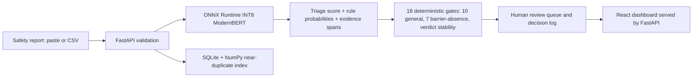

# SIF Precursor Triage — SIH 2026 PS 26165

**Oil India Limited (OIL)** · AI/NLP support for Unsafe-Act / Unsafe-Condition and near-miss reports.

The local-first application combines a ModernBERT multi-task model served through ONNX Runtime with deterministic gates and a human review dashboard. The gate chain has 18 checks (10 general, seven barrier-absence checks, and `verdict_stability`); these annotate or route reports and do not alter the calibrated score. **Model proposes; an HSE reviewer disposes.**

> **Claim boundary:** triage, evidence extraction, and queue compression only. This is not an injury/fatality predictor. We do not claim prediction accuracy, field prevalence, or reviewer-time savings.

## Architecture



Runtime stack: FastAPI, SQLite, NumPy, pure-Python gates, ONNX Runtime and a prebuilt React dashboard. Runtime does not require PyTorch, Docker, or a cloud service. Optional local Ollama explanation rewording is disabled by default; deterministic templates are used. Model startup also applies a PR-AUC smoke gate; this is not equivalent to a passing INT8 export parity gate (the checked-in export gate is `pass:false`).

The frontend uses React 19, TypeScript, Vite 8, Tailwind 4, and HashRouter. The adopted visual contract uses an Astryx-derived semantic token model mapped onto Tailwind and motion-primitives as the interaction layer; it is **not** a StyleX migration. See [`docs/design-system-spec.md`](docs/design-system-spec.md) and [`docs/design-system-token-gallery.md`](docs/design-system-token-gallery.md). Stack decisions: [`docs/frontend-stack-decision.md`](docs/frontend-stack-decision.md) and [`docs/backend-stack-decision.md`](docs/backend-stack-decision.md).

## Current measurements and qualifications

These measurements are tied to their stated evaluation source. Demo-seed results are not estimates of OIL field rates.

| Measurement | Result and scope |
|---|---|
| Demo seed v3 (2026-09-26) | 4,548 synthetic/demo rows; 338 flagged (7.43%) at threshold 0.5647. These are seed behavior, not field prevalence. Source: [`docs/overhaul-summary.md`](docs/overhaul-summary.md). |
| Paired near-miss probe | Without runtime masking: 0.5819 → 0.3042 after adding “Fortunately no injury occurred” (−0.278). With runtime masking: 0.5819 → 0.5632 (−0.019). This is a targeted probe, not a general validity result. See [`docs/discovery/60-orchestrator-novel-probe.md`](docs/discovery/60-orchestrator-novel-probe.md). |
| Barrier probe (2026-09-27) | Expert-authored, not human gold. At threshold 0.5647: barrier stratum n=22, model flag recall 0.2727 and routed recall 0.8182 (flags OR gray-gate routes); mechanism n=12, flag recall 0.8333 and routed recall 0.9167; benign n=16, false-flag rate 0.0625 and false-gray rate 0.0625. Source: [`artifacts/qa-evidence/probe_process_safety.json`](artifacts/qa-evidence/probe_process_safety.json). |
| Calibration diagnostics | Derived-label temporal test split n=17,731: calibrated ECE 0.1475 / Brier 0.1580. Gold-consensus sample n=407: ECE 0.1765 / Brier 0.1830. These do not establish deployment calibration. See [`artifacts/models/masked-v2/metrics.json`](artifacts/models/masked-v2/metrics.json) and [`training/eval_calibration.py`](training/eval_calibration.py). |
| Blind human-gold evaluation (historical single-text operating point 0.658108) | Real pooled consensus n=318; prevalence 89.9%; precision 0.976 [0.948, 0.989], recall 0.836 [0.788, 0.874], F1 0.900. Precision at this high sample prevalence does not transfer to deployment traffic; 93 of 500 items remain pending adjudication. A current-threshold single-text re-evaluation (not the serving N=4 ensemble) reports precision 0.972 [0.943, 0.986], recall 0.843 [0.796, 0.880] at 0.5647; the sampled OSHA gold overlaps the threshold-tuning temporal split, so this is not fully held out. Sources: [`artifacts/gold/gold_metrics_final.md`](artifacts/gold/gold_metrics_final.md) and [`artifacts/gold/gold_metrics_current_point_20260926.md`](artifacts/gold/gold_metrics_current_point_20260926.md). |
| INT8 export gate | `pass:false`; agreement 0.993 and AUC drop 0.1305. See [`artifacts/models/masked-v2/export_gate.json`](artifacts/models/masked-v2/export_gate.json). |
| Bulk ingest | About 7.3 rows/s in the cited 500-row run; this is below the earlier 45.6 rows/s claim, which is withdrawn. See [`docs/discovery/24-be-api.md`](docs/discovery/24-be-api.md). |

Approximately 20% refers to the share of **recordable injuries** with SIF potential (BST/Mercer ORC 2011; Martin & Black 2015). It does not describe the share of reports or near-miss reports.

## Current limitations and open work

- Training uses U.S. post-injury proxy data and synthetic text, not OIL's report register. No demo-seed rate is a field-prevalence estimate.
- The demo seed v3 flag rate is 7.43% (338/4,548) at threshold 0.5647; this is a synthetic-seed measurement, not a field-prevalence estimate. See [`docs/overhaul-summary.md`](docs/overhaul-summary.md).
- Barrier recall remains incomplete in the expert-authored probe, not human gold (2026-09-27; threshold 0.5647): barrier n=22 model flag recall 0.2727 and routed recall 0.8182 (flags OR gray-gate routes); mechanism n=12 flag recall 0.8333 and routed recall 0.9167; benign n=16 false-flag rate 0.0625 and false-gray rate 0.0625. No benign barrier-gate false-gray occurred (0/16). Source: [`artifacts/qa-evidence/probe_process_safety.json`](artifacts/qa-evidence/probe_process_safety.json).
- Self-consistency (`SIF_SELF_CONSISTENCY_N=4` by default) improves repeatability, not correctness. Runtime masking reduced the measured near-miss regression in the paired probe but does not establish general validity.
- `/api/classify` and stored `/api/reports` GET responses return the server-owned band, `flag_threshold`, and gray-band bounds; stored rows are re-banded from the current classifier operating point when read. Date filters are available on reports and density, and analytics has a custom date-range picker.
- Ingest-job DELETE supports cooperative cancellation before commit; once a job is committing or finished, cancellation is rejected (409).
- No validated deployment-prevalence precision, prediction accuracy, or reviewer-time-saved measurement is claimed.
- The real-model adversarial suite passes 18/18 cases plus #10b. Contracts now reflect ensemble scoring for case #2 and allow an independent stability-gray route on otherwise clean cases; hero weld case #16 still requires its true `fire_watch_absent` route. The isolated browser e2e suite passed 10/10 in the prior 2026-09-26 run (throwaway-DB stack, real INT8 classifier).

## Quickstart

Requires Python 3.14, Node/npm, and the INT8 ONNX model at `artifacts/models/masked-v2/sif_multitask_int8.onnx`. The model artifact is not tracked by git; obtain it from the packaged bundle (the pendrive payload) or use a working tree where it is already present. Installing dependencies requires network access; normal runtime inference is local. The fresh runtime database is empty; the commands below do not seed demo rows.

```bash
# From the repository root; ensure the model artifact is in place first
python3 -m venv .venv
.venv/bin/pip install -r requirements.txt

cd dashboard && npm ci && npx tsc -b && npx vite build
cd ..
./run.sh
```

`./run.sh` starts the API and serves the dashboard at `http://127.0.0.1:8177/`. For demo data, set `SIF_DB_PATH` to a prepared database path before starting the app. The root redirects to `/#/queue`. Other dashboard URLs:

- `/#/queue`
- `/#/report/1`
- `/#/analytics`
- `/#/ingest`
- `/#/decisions`
- `/#/settings`

Hash URLs are canonical; the API server also provides an SPA fallback for non-API paths such as `/queue`. Check that the running server uses the real classifier with:

```bash
curl -s http://127.0.0.1:8177/api/health
```

A successful health response should report `"classifier":"RealOnnxClassifier"`. To stop a server started by `run.sh`, use `./run.sh --stop`.

## Isolated browser end-to-end tests

These tests write to their database. Do not point them at the live demo on port 8177. After confirming port 8232 is free, start the isolated server from the repository root; it copies the demo DB into a temporary directory and uses the real INT8 model. The Playwright config does not manage server lifecycle:

```bash
E2E_PORT=8232 bash dashboard/e2e/serve-isolated.sh
```

In a second terminal:

```bash
cd dashboard && PLAYWRIGHT_BASE_URL=http://127.0.0.1:8232 E2E_API=http://127.0.0.1:8232 npm run test:e2e
```

Stop only the server you started with Ctrl-C and confirm its port is free. The script defaults to 8232; `E2E_PORT` can override it. `PLAYWRIGHT_BASE_URL` disables lifecycle management in the config, so start this server yourself as shown. The end-to-end suite passed 10/10 in the 2026-09-26 run against the isolated stack.

## Relevant paths

- `app/`: FastAPI service, classifier, storage, gates, and explanation renderer.
- `dashboard/`: React application and Playwright end-to-end tests.
- `data_pipeline/`: corpus, seed, masking, and pattern-generation utilities.
- `training/`: model training and evaluation tools, including calibration diagnostics.
- `artifacts/models/masked-v2/`: shipped model files and metrics.
- `docs/overhaul-summary.md`: current status, known gaps, measurements, and verification notes.
- `docs/architecture.md`: runtime architecture and API boundaries.

Historical plans and discovery measurements may describe superseded system states; prefer the current limitations above and the dated source artifacts when interpreting old figures.