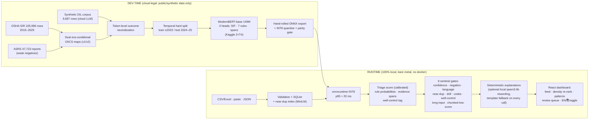

# SIF-Precursor Detection Engine

**SIH 2026 Problem Statement 26165 — OIL India Limited**

A local-first triage engine that surfaces Serious Injury & Fatality (SIF) precursors
buried in routine incident and near-miss reports, so HSE reviewers can prioritize
what to read first. **"Model proposes, HSE disposes."**

> **Claim boundary:** this is a triage + extraction tool. We report triage score,
> extraction precision, and reviewer time saved — **never prediction accuracy**.
> See [Honest claims](#honest-claims).

## Architecture



Source of truth: [`runs/run2/ARCHITECTURE.md`](runs/run2/ARCHITECTURE.md)
(adjudicated v2, 2026-09-08) with rulings in [`runs/run2/DECISION_LOG.md`](runs/run2/DECISION_LOG.md).

Dev-time: OSHA SIR + ASRS data → era-conditional OIICS label maps → token-level
outcome neutralization → synthetic OIL corpus (cloud LLM) → temporal hard split →
ModernBERT-base multi-task fine-tune on Kaggle GPU → hand-rolled ONNX export →
two-tier parity gate → INT8 artifact.

Runtime (100% local, bare metal): CSV/Excel/paste/JSON ingestion → validation +
near-dup index (SQLite + numpy) → FastAPI + onnxruntime INT8 multi-task model →
SIF triage score (calibrated), 7-rule probabilities + well-control/barrier tag,
evidence spans → deterministic explanation templates (optional Ollama qwen3:4b
rewording with template fallback) → React dashboard with 4 engineered gray states.

## Repository layout

| Path | Contents |
|---|---|
| `app/` | FastAPI runtime service + explanation renderer |
| `data_pipeline/` | Parse, dedup, label derivation, masking, synthetic corpus, splits |
| `training/` | Kaggle notebooks/scripts: fine-tune, export, parity gate |
| `dashboard/` | React dashboard (shadcn/ui + Tailwind, navy theme) |
| `spec/` | Frozen specs (`label_spec.yaml` etc.) + `spec/drafts/` |
| `artifacts/` | Versioned model artifacts (ONNX + metrics.json + label_spec hash) |
| `tests/` | Golden regression, adversarial suite, parity checks |
| `notebooks/` | Exploratory / validation notebooks |

## Quickstart

**System requirements:** Linux x86_64 · Python 3.14 · 4 cores · 8 GB RAM free
(+3.2 GB if qwen3:4b rewording runs) · no network at demo time.

First-time setup (needs network once):

```bash
python3 -m venv .venv && .venv/bin/pip install -r requirements.txt
cd dashboard && npm ci && npm run build && cd ..
```

Then one command brings up the whole demo — **bare-metal, 100% offline, no docker**
(uvicorn + static React dashboard + SQLite; ARCHITECTURE runtime section):

```bash
./run.sh            # preflight → ollama → API+dashboard on http://127.0.0.1:8177/
./run.sh --stop     # stop what run.sh started (pidfiles in .run/)
```

`run.sh` checks the .venv, the prebuilt dashboard, and the ONNX model artifact
(clear error + retrieval hint if the model is missing; dev-only bypass:
`./run.sh --allow-mock`). If ollama isn't running it starts one with
`OLLAMA_NUM_PARALLEL=6` (DECISION_LOG D18); an already-running ollama is reused
and never killed by `--stop`. If ollama is absent entirely, the deterministic
explanation templates carry the demo (template fallback by design).

**Offline / USB install:** `packaging/make_tarball.sh` builds the air-gapped
bundle (code + prebuilt dashboard + model artifacts + vendored tokenizer +
Python wheels, excluding `data/` and `runs/` raw research — see
[`packaging/manifest.md`](packaging/manifest.md) for contents, exact sizes, and
ollama model-blob instructions). On the target: `packaging/install.sh` then
`./run.sh`. `packaging/selfcheck.sh` runs two full
start→health→classify→stop cycles as the bring-up proof.

**Demo flow:** open `http://127.0.0.1:8177/` → paste/upload incident reports →
triage card with amber review-priority band + highlighted evidence spans →
site/activity precursor-density ranking → pattern cards with n + Wilson CIs →
Confirm/Not-SIF override queue ("model proposes, HSE disposes").

Dev/training environment (torch CPU wheel locally; real training on Kaggle):
```bash
pip install torch --index-url https://download.pytorch.org/whl/cpu
pip install -r requirements-dev.txt
```

## Honest claims

Every number below was measured on the demo machine within 72 h of the demo and
traces to a file (see [`runs/run2/kb/KNOWLEDGE_BASE.md`](runs/run2/kb/KNOWLEDGE_BASE.md)
§10–12, [`runs/run2/day2/ship_decision.md`](runs/run2/day2/ship_decision.md),
and [`runs/run2/day2/latency_v2_final.md`](runs/run2/day2/latency_v2_final.md)):

| Claim | Measured value |
|---|---|
| Operating point (max recall @ precision ≥ 0.80), derived-label temporal holdout, n = 17,731 | **P 0.8000 · R 0.9748 · F1 0.8788** (proxy labels; the blind human gold verdict is the next row) |
| **Blind human gold — FINAL (2026-09-10)** | 500 blind-labeled reports (300 OSHA 2024–25 incl. 150 oil-gas + 100 ASRS + 100 synthetic), 4 labelers. Real-pooled headline (n = 318 human-consensus): **P 0.976 [0.948, 0.989] · R 0.836 [0.788, 0.874] · F1 0.900**; Fleiss κ 0.513 ± 0.066 (130 doubles). ASRS stratum recall 0.00 — aviation is fully out-of-distribution, disclosed. Synthetic stratum reported separately (P 0.347), never pooled. 93 split/unsure items excluded pending adjudication. Full detail: [`artifacts/gold/gold_metrics_final.md`](artifacts/gold/gold_metrics_final.md) |
| Classify latency, single report, CPU-only, 8 threads (masked-v2 int8, model-only ship path) | p50 11.4 ms · **p95 17.7 ms** · p99 20.5 ms |
| Bulk ingest, end-to-end | **45.6 reports/s** (5,050-row CSV → 5,048 accepted, 110.8 s wall; SLA ≥30/s) |
| Evidence spans | 100% exact-substring validity, self-validated before render; invalid spans dropped, never shown |
| Near-dup detection | measured cosine threshold 0.91 on a 70,398-vector MiniLM index, p95 3.8 ms |
| Fine-tune vs zero-shot qwen3:8b (McNemar, Holm-corrected, n = 1,500) | fine-tune wins, **p = 0.0018**, at 1,083× lower per-classification latency |
| Fine-tune vs TF-IDF+LogReg (same sample) | **not significant (p = 0.122) — disclosed, not hidden** |
| Adversarial suite / packaging | 18/18 PASS · self-check: 2 clean start→classify→stop cycles |
| Training cost | 4.19 + 1.11 GPU-h of a 30 h weekly Kaggle quota |
| Air-gapped operation | zero external requests in the demo path by design; physical-unplug run is a scripted demo beat |

What this system is:

- A **triage and evidence-extraction tool** that ranks reports by review priority
  and highlights the text spans behind each flag.
- Calibrated **triage scores** — never "% accuracy", never "SIF detected".
- Statistics with honest uncertainty: pattern mining reports n + Wilson CIs;
  metrics carry corrected Wilson confidence intervals.

What this system is not:

- **Not a predictor of injuries or fatalities.** We never claim prediction accuracy.
- The "~20%" figure is ~20% of *recordable injuries* having SIF potential
  (BST/Mercer ORC 2011; Martin & Black 2015) — **not** "20-25% of near-miss
  reports". We measure and report our own flag rate.
- IOGP Life-Saving Rules 8 (Work Authorisation / Permit to Work) and Bypassing
  Safety Controls are **declared out of scope** (<0.1% detectable in free text) —
  shown as such in the UI, never faked.
- On Baghjan-class events: the precursors existed and were buried in routine
  reports — we make them impossible to bury. We do **not** claim this tool would
  have prevented any past incident.

Gray states (low-confidence / negation / non-English / near-duplicate) are a
first-class humility system, not error paths.
