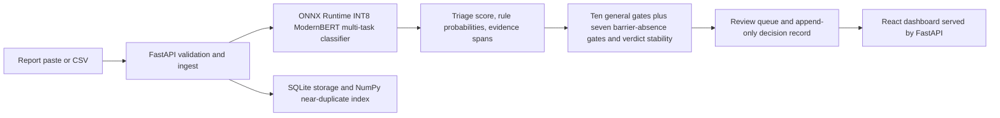

# Architecture — SIF Precursor Triage Engine

**SIH 2026 · PS 26165 · Oil India Limited (OIL)**

This document describes the current local application, not the historical architecture proposals in `runs/run2/ARCHITECTURE.md` or the old handoff plan. The product boundary is **triage, evidence extraction, and queue compression**. It does not predict injuries or fatalities and makes no prediction-accuracy claim.

## 1. Runtime overview



Runtime stack: FastAPI and Uvicorn, SQLite, NumPy, pure-Python gates, ONNX Runtime INT8, and a prebuilt React dashboard. Runtime has no PyTorch dependency and no Docker requirement. Optional local Ollama explanation rewording is disabled by default; deterministic templates remain the explanation path. No cloud inference is part of the design. Startup includes a PR-AUC smoke gate; this does not override the artifact's separate failing INT8 export-parity result (`pass:false`).

The dashboard is React 19, TypeScript, Vite 8, Tailwind 4, and React Router's HashRouter. Its six surfaces are queue, report, analytics, ingest, decisions, and settings. FastAPI serves the static `dashboard/dist` bundle from the same process. Hash routes such as `/#/queue` need no server-side route change; unmatched static paths such as `/queue` also receive the SPA shell fallback, while `/api` and asset failures remain errors.

## 2. Request and persistence paths

### Classification

`POST /api/classify` validates a report, calls the configured classifier, checks evidence spans against the original text, then runs the deterministic gate family. The ONNX classifier uses runtime masking and a default four-variant deterministic self-consistency ensemble (`SIF_SELF_CONSISTENCY_N=4`, configurable). The returned score is an operating-point triage score; self-consistency describes repeatability, not correctness.

`/api/classify` and stored-report GET endpoints return the server-owned band. The `/api/reports` and `/api/density` routes accept `date_from` and `date_to`; analytics also exposes a date-range picker.

### Ingest

`POST /api/ingest` accepts records or CSV, validates and deduplicates rows, and writes accepted reports through SQLite. Large requests return a job id; progress can be polled with `GET /api/ingest/{job_id}`. `DELETE /api/ingest/{job_id}` requests cooperative cancellation before the atomic write commit; queued jobs are marked cancelled immediately, and cancellation returns 409 once the job is committing or finished (including done, error, or cancelled states). The measured bulk rate in the 500-row run was approximately 7.3 rows/s, not the historical 45.6 rows/s claim.

The reports and density routes accept `date_from` and `date_to`; `/api/patterns` does not accept date filters.

### Storage and decisions

SQLite uses WAL, a configured busy timeout, secondary indexes, and an `actions` table for CAPA-style action data. Decision records are append-only and can supersede prior decisions; the export route returns NDJSON. Rationale and reviewer identity are part of the intended UI contract. These features support audit workflows but do not constitute a certified safety-management system.

## 3. Gate family

The current dispatch has ten general gates, seven explicit barrier-absence gates, and verdict stability (18 total):

- General: `min_length`, `negation`, `language`, `confidence`, `drill`, `near_dup`, `long_input`, `well_control_watch`, `chunked_low_score`, `severity_watch`.
- Barrier absence: `energy_isolation_absent`, `gas_test_absent`, `permit_absent`, `fire_watch_absent`, `standby_absent`, `atmosphere_unmonitored`, `fall_protection_absent`.
- Ensemble reliability: `verdict_stability`.

Gate behavior is deterministic routing/annotation support. A triggered gray gate can route a report to human review, including when the model score is below the flag threshold. `verdict_stability` triggers when at least two variants were scored and fewer than 75% agree with the ensemble verdict; it does not change the triage score or operating point. It does not mean a gate detects every relevant incident or establishes safety.

The expert-authored process-safety probe (2026-09-27) used threshold 0.5647. The barrier stratum (n=22) had model flag recall 0.2727 and routed recall 0.8182 (flag OR gray-gate routing); mechanism (n=12) had flag recall 0.8333 and routed recall 0.9167; benign (n=16) had false-flag rate 0.0625 and false-gray rate 0.0625. Probe labels are not human gold. Source: [`../artifacts/qa-evidence/probe_process_safety.json`](../artifacts/qa-evidence/probe_process_safety.json).

## 4. Evaluation and claim boundaries

### Demo seed

The demo seed v3 (final, 2026-09-26) contains 4,548 rows, with 338 flagged (7.43%) at the calibrated operating point 0.5647. The N=4 ensemble is used on the write path. These are properties of a synthetic demonstration dataset, not OIL field statistics. Source: [`overhaul-summary.md`](overhaul-summary.md). Earlier seed measurements are historical and superseded.

### Masking and self-consistency

A paired LOTO near-miss probe changed from 0.5819 to 0.3042 when “Fortunately no injury occurred” was added without runtime masking (delta −0.278), and from 0.5819 to 0.5632 with runtime masking (delta −0.019). This is one targeted regression probe. It is evidence that runtime masking mitigates this particular penalty, not a general accuracy or validity result. Self-consistency smooths surface-variant scores and should be described as a reliability mechanism only.

### Calibration

Calibration diagnostics are available in `artifacts/models/masked-v2/metrics.json`, generated by `training/eval_calibration.py`:

- Derived-label temporal test split, n=17,731: calibrated ECE 0.1475; Brier 0.1580.
- Gold-consensus sample, n=407: ECE 0.1765; Brier 0.1830.

These are sample-specific calibration measurements. They do not establish performance at OIL deployment prevalence. The INT8 export gate remains `pass:false` in `artifacts/models/masked-v2/export_gate.json` (agreement 0.993; AUC drop 0.1305).

### Human gold

The final gold report has 318 real pooled consensus cases at 89.9% positive prevalence (P 0.976, R 0.836, F1 0.900); 93 of the original 500 remain pending adjudication. High-prevalence pooled precision should not be transferred to deployment. Source: [`../artifacts/gold/gold_metrics_final.md`](../artifacts/gold/gold_metrics_final.md).

Approximately 20% in the cited literature means the share of **recordable injuries** with SIF potential (BST/Mercer ORC 2011; Martin & Black 2015), never the share of reports or near-miss reports.

## 5. Limitations and work in progress

1. Training uses U.S. post-injury proxy data and synthetic text, not OIL's own reports. The demo seed is not field data.
2. The synthetic demo seed v3 flag rate is 7.43% (338/4,548) at 0.5647; this is seed behavior, not a field-prevalence estimate (source: [`overhaul-summary.md`](overhaul-summary.md)).
3. Barrier detection is incomplete: the 2026-09-27 expert-authored probe reports barrier n=22 model flag recall 0.2727 and routed recall 0.8182 (flag OR gray-gate routing); mechanism n=12 flag recall 0.8333 and routed recall 0.9167; benign n=16 false-flag rate 0.0625 and false-gray rate 0.0625. No benign barrier-gate false-gray occurred (0/16). This is not human-gold validation (source: [`../artifacts/qa-evidence/probe_process_safety.json`](../artifacts/qa-evidence/probe_process_safety.json)).
4. Runtime masking reduces the tested near-miss score penalty, but one probe cannot establish general validity. Self-consistency and stability routing address repeatability, not correctness. The adversarial suite passes its current hero-weld contract: the true `fire_watch_absent` gate routes it to review.
5. Reports and density support date filters, with a custom date range on analytics; patterns do not accept date filters.
6. `DELETE /api/ingest/{job_id}` supports cooperative cancellation before commit; cancellation returns 409 once the job is committing or finished.
7. Bulk ingest measured about 7.3 rows/s in the cited 500-row test.
8. The INT8 export gate is recorded as failing (`pass:false`); report that qualification wherever model performance is summarized.
9. No validated deployment-prevalence precision, injury-prediction accuracy, or reviewer-time-saved result is claimed.

## 6. Local development and serving

From the repository root, with Python 3.14, Node/npm, and the INT8 model at `artifacts/models/masked-v2/sif_multitask_int8.onnx`. The model artifact is not tracked by git; obtain it from the packaged bundle (the pendrive payload) or use a working tree where it is already present.

```bash
python3 -m venv .venv
.venv/bin/pip install -r requirements.txt

cd dashboard && npm ci && npx tsc -b && npx vite build
cd ..
./run.sh
```

A fresh start creates an empty `app/runtime.db`; the commands above do not seed demo reports. `./run.sh` binds to 127.0.0.1:8177 by default, starts Uvicorn, and serves the built dashboard. Visit `http://127.0.0.1:8177/#/queue` or the other HashRouter URLs. The health endpoint is `http://127.0.0.1:8177/api/health`; the expected real classifier value is `RealOnnxClassifier`. The live port should not be restarted during shared QA.

For browser tests, `dashboard/e2e/serve-isolated.sh` creates a temporary database copy and pins the INT8 model. Its default is 8232; `E2E_PORT` can override it after confirming the chosen port is free. Start from the repository root:

```bash
E2E_PORT=8232 bash dashboard/e2e/serve-isolated.sh
```

Then in another terminal:

```bash
cd dashboard && PLAYWRIGHT_BASE_URL=http://127.0.0.1:8232 E2E_API=http://127.0.0.1:8232 npm run test:e2e
```

The Playwright config does not manage server lifecycle, so start this process yourself after confirming its port is free; stop only the process you started with Ctrl-C and do not stop an unrelated listener. The browser end-to-end suite passed 10/10 on 2026-09-26 against an isolated throwaway-DB stack with the real INT8 classifier; see [`overhaul-summary.md`](overhaul-summary.md).

## 7. Source docs

- [`design-system-spec.md`](design-system-spec.md) — binding UI component and token contract.
- [`design-system-token-gallery.md`](design-system-token-gallery.md) — implemented token values and accessibility notes.
- [`backend-stack-decision.md`](backend-stack-decision.md) and [`frontend-stack-decision.md`](frontend-stack-decision.md) — technology decisions and trade-offs.
- [`implementation-plan.md`](implementation-plan.md) — historical workstreams and gates. Many statuses and intended counts in it predate the current code; use `overhaul-summary.md` for current state.
- [`overhaul-summary.md`](overhaul-summary.md) — current measurements, limitations, setup, and this audit's verification results.

Historical research documents record measurements from their own dates and contexts. Treat them as historical sources, not current runtime status unless explicitly revalidated in the current summary.