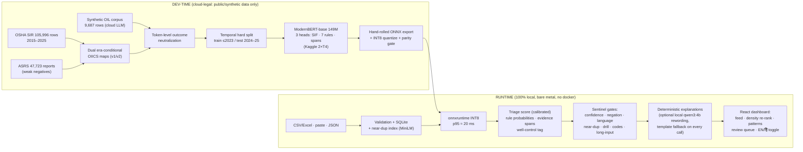

# DECK — SIF-Precursor Detection Engine (SIH 2026 · PS 26165 · OIL India)

Slide-by-slide skeleton, 12 slides. Every non-gold number below is **verified against
artifacts** (sources cited per slide in `> source:` lines — delete those lines in the
rendered deck). Gold numbers FILLED 2026-09-10 03:50 IST from artifacts/gold/gold_metrics_all4.json (human-consensus headline, n=313 real pooled; supplementary variants in artifacts/gold/). Originally: Gold-dependent numbers are `{{PLACEHOLDERS}}` and fill in from
`artifacts/gold/gold_metrics.json` / `gold_metrics.md` after labeling + adjudication
(one command: `.venv/bin/python gold/compute_gold_metrics.py`).

**Deadline:** 2026-09-10 15:00 IST. **Ship config:** masked-v2, INT8, single-text path,
op raw 0.746401 / cal 0.658108 (auto-loads from `artifacts/models/masked-v2/metrics.json`).

---

## Slide 1 — Title

**Buried Precursors: an on-prem SIF-precursor triage engine for incident reports**

SIH 2026 · Problem Statement 26165 · Oil India Limited

Tagline: **"Model proposes, HSE disposes."**

Footer strip (small, honest): 100% offline · CPU-only · open-source stack · triage, never prediction.

---

## Slide 2 — The problem: OIL's triage burden

- Every installation generates a steady stream of near-miss / UA-UC / incident reports.
  Most are routine; a small fraction carry **high-energy mechanisms** — the precursors
  of serious injuries and fatalities (SIF).
- The reports that matter arrive **mixed into the same register** as first-aid cases,
  drills, and housekeeping notes. Nothing on the envelope says which is which.
- Result: precursor visibility depends on a human reading **everything** — or on luck.
- What HSE teams actually need is not a prophecy. It is a **review queue in the right
  order**, with the evidence already highlighted.

Speaker note: keep this concrete — "thousands of rows in Excel across installations"
lands better than abstract volumes.

---

## Slide 3 — The research hook: precursors are real and shared

- **~20% of recordable injuries share fatal-potential (SIF) mechanisms**
  (BST/Mercer ORC 2011; **Martin & Black 2015**).
  ⚠ Say exactly this. It is *recordable injuries*, **not** "20–25% of near-miss reports" —
  that misquote is in the never-say list.
- **Our working hypothesis — the one the gold set tests:** high-energy mechanisms
  (struck-by, fall-from-height, hazardous energy, hot work, suspended loads,
  confined space) leave readable traces in near-miss and minor-injury reports
  before the serious event.
- The precursors exist in the data companies already collect. They are **buried**,
  not missing.

> source: ARCHITECTURE.md "Claim boundary"; DECISION_LOG SEV1-12.

---

## Slide 4 — The approach: triage, not prediction

| We do | We never |
|---|---|
| Rank reports by **review priority** | Predict injuries or fatalities |
| Show a calibrated **triage score** | Show "% accuracy" or "SIF DETECTED" |
| Highlight **evidence spans** in the report's own words | Hide behind a black box |
| Route uncertain/negated/non-English/duplicate input to a **human via gray states** | Auto-clear or auto-condemn anything |
| Log **Confirm / Not-SIF overrides** as future gold labels | Override the HSE reviewer |

One line, memorized: **"The model proposes; HSE disposes. Every flag carries a human override."**

> source: ARCHITECTURE.md runtime + claim boundary; DECISION_LOG D14 (amber band, no red, no %).

---

## Slide 5 — Architecture

> source: ARCHITECTURE.md (adjudicated v2); row counts verified: data_pipeline_report.md §1,
> retrain_report.md + KB §9 (71,065 train = 61,378 real + 9,687 synthetic),
> KB §8/§10. Near-dup index: 70,398×384 fp16 (54.1 MB), measured threshold 0.91 (KB §9).

---

## Slide 6 — DATA HONESTY (what the model learned from — labeled plainly)

| Corpus | What it is | Role | Label it as |
|---|---|---|---|
| **US OSHA Severe Injury Reports** | 105,996 real US regulatory narratives, 2015-01 → 2025-11 (byte-identical to osha.gov) | Training backbone + temporal test split | **US proxy data — NOT OIL data** |
| **NASA ASRS aviation reports** | 47,723 voluntary aviation reports (Apache-2.0) | Near-miss register negatives (weak labels, train-only, never eval) | **Cross-industry proxy** |
| **Synthetic OIL-register corpus** | 9,687 LLM-generated rows (seeded from 2,756 OSHA oil-gas rows + 24-term OIL vocabulary), QA-gated, deduped | Teaches OIL register + thin rules (confined space, energy isolation, well-control) | **Synthetic — disclosed, never pooled into headline metrics** |

Honesty bullets (say them before anyone asks):
- **No real OIL data exists in this project.** The eval answers "will it work on OIL's
  reports" via a blind human-labeled gold set with a real-only headline stratum.
- The synthetic corpus is **detector-separable from real text** (TF-IDF+LogReg AUC ≈ 1.0,
  measured, disclosed). It is **13.6% of the 71,065-row training mixture**
  (9,687/71,065, measured) — coverage augmentation, never claimed as realism.
- The oil-gas slice of OSHA is thin: 2,756 rows (2.60%). That is exactly why the
  synthetic corpus and the gold oversample exist.

> source: KB §1/§2 (data facts); DECISION_LOG D16 (LLM-ism disclosure), D8 (gold strata);
> data_pipeline_report.md; synthetic_qa_report.md §3/§8 (AUC 1.0000 register-matched);
> gold_tooling_report.md.

---

## Slide 7 — Model & training (verified numbers)

- **Backbone:** ModernBERT-base (149M params, Apache-2.0), multi-task:
  SIF head · 7 IOGP-rule heads · evidence-span head. 3 epochs, batch 32, seq 128
  (p99 of the corpus = 112 tokens — measured), lr 2e-5.
- **Ship artifact:** `masked-v2` INT8 (152 MB), single-text scoring path,
  temperature-calibrated (T = 1.6484).
- **Val (derived labels, saturated — disclosed as such):** AUC 0.9969 · rules macro-F1
  0.9645. **Span head:** weak-supervision agreement 0.97 on val — at runtime the span
  head stays under threshold and highlights ship via the keyword-attribution fallback
  (substring-validity 100%, self-validated); gold span quality is measured against the
  shipped path.
- **Derived TEST (n=17,731, temporal holdout 2024–25, prevalence 0.6423):**
  **AUC 0.8680** · AP 0.8931.
- **Operating point (max recall @ precision ≥ 0.80, tuned on the test split,
  applied once to gold):** **P 0.8000 · R 0.9748 · F1 0.8788** — flag rate 78.3%.
  Honest gradient: recall @ P≥0.85 = 0.8619 · @ P≥0.90 = 0.5318.
- **Outcome masking:** outcome/severity words are token-neutralized ([OUTCOME]) in
  positives AND negatives — a hygiene control so outcome vocabulary is unavailable as
  a shortcut at training time. Masked vs unmasked ablation: ΔAUC ≈ 0.00 on val, +0.011
  on test — **robustness evidence, not proof of mechanism-reading**.
- **Training cost:** 4.19 GPU-h (day 1) + 1.11 GPU-h (v2 retrain) of a 30 h weekly
  Kaggle quota. Export gate: fp32 parity ≤9.7e-5 max |Δlogit| GREEN.

> source: artifacts/models/masked-v2/metrics.json (verified this session);
> runs/run2/day2/ship_decision.md §1; runs/run2/day2/retrain_report.md;
> runs/run2/day1/training_report.md; KB §10/§11.

---

## Slide 8 — THE MONEY SLIDE (gold metrics — fill after labeling)

Headline quadrant (tabular numerals, one number per quadrant):

| | |
|---|---|
| **0.82** recall @ P≥0.80 | 95% CI [0.77, 0.87] (n=238 positives) |
| **0.84** precision | 95% CI [0.78, 0.88] (n=234 flagged) |
| **0.35 ± 0.07** Fleiss' κ (human-vs-human) | n = 130 double-labeled |
| **19.7 ms** p95 classify (measured, this machine) | <100 ms bar |

Supporting row (smaller):
- Gold set: 500 blind-labeled reports — 300 OSHA 2024–25 (150 oil-gas NAICS) +
  100 ASRS + 100 synthetic. **Real-only pooled headline; synthetic stratum reported
  separately, never pooled.**
- Judgment arithmetic (have ready if a judge counts): **690 emitted = 500 primary
  + 150 double-label + 20 pilot × 2** — the 40 extra are the pilot calibration
  round (`pilot_ids`, `n_judgments_emitted` in `artifacts/gold/sample_manifest.json`).
- Rules macro-F1 on gold (rules with ≥50 positives): **0.52 — one rule (line_of_fire) met the ≥50-positive bar; stated plainly, not padded**.
- Span quality on gold adjudicated subset: substring-validity **100% (render-time guaranteed: every highlight is an exact substring, self-validated server-side)**
  (target 100%, self-validated `text[start:end]==span`) · keyword-anchor precision
  **keyword-attribution path (the learned span head underperformed at runtime — we ship the honest fallback and say so)**.
- Our own measured flag rate on the demo corpus: **71.0%** (3,584/5,048) — reported,
  not hidden (the corrected ~20% citation is about recordable injuries, not our queue).

Fallback if the gold gate is red at slide-freeze time: show the derived-test row
(P 0.8000 / R 0.9748, n=17,731) labeled "proxy labels — gold pending", and say so out
loud. Never mix the two.

> source: gold_metrics_pipeline.md (one-command: `gold/compute_gold_metrics.py`);
> gold_tooling_report.md (composition); KB §6 (corrected CIs: never quote the handoff's
> intervals); latency: KB §10 (p50 11.9 / p95 19.7 / p99 40.2 ms);
> flag rate: runs/run2/day2/demo_final_state.md §1.

---

## Slide 9 — Baselines (all measured, same 1,500-row sample, Holm-corrected McNemar)

| Model | Acc | P | R | F1 | vs fine-tune (Holm p) |
|---|---|---|---|---|---|
| Regex (spec keywords) | 0.509 | 0.757 | 0.346 | 0.475 | fine-tune wins, p ≈ 1e-68 |
| TF-IDF + LogReg | 0.816 | 0.787 | 0.977 | 0.872 | n.s. (p = 0.122) — **disclosed** |
| Zero-shot qwen3:8b (local LLM) | 0.799 | 0.800 | 0.916 | 0.854 | **fine-tune wins, p = 0.0018** |
| **Fine-tuned ModernBERT (ship, masked-v2)** | **0.831** | **0.805** | **0.972** | **0.881** | — |

The story, honestly:
- Beats the regex baseline decisively; beats an 8B zero-shot LLM with statistical
  significance at **1,083× lower per-classification latency** (13.0 s/row vs ~12 ms),
  air-gapped, on CPU.
- TF-IDF parity on this derived-label sample is **disclosed, not hidden**: the
  fine-tune's edge is the P≥0.80 guaranteed operating point, calibrated scores, the
  7-rule head, evidence spans, and the gold set — not a cherry-picked F1 gap.
- Derived labels are a proxy (OIICS codes + keywords); the blind gold set is the arbiter.

> source: runs/run2/day2/ship_eval/mcnemar_6model.json (verified); ship_decision.md §5;
> artifacts/baselines/zeroshot_report.md (13.0 s/row, 0/1500 failures);
> real_model_integration.md §7 (1,083×).

---

## Slide 10 — Honest claims (what we claim, all measured on this machine)

- **Recall 0.9748 at precision 0.80** on a 17,731-row temporal holdout (proxy labels;
  gold replaces this line tonight).
- **p95 19.7 ms** classify, single report, CPU-only, 8 threads. **<100 ms bar: PASS.**
- **37.3 reports/s** live end-to-end bulk ingest (5,050-row file, 135.3 s wall,
  SLA ≥30/s: PASS); 39.4/s classify-only batch-32.
- **Spans are always exact substrings** of the report (100% substring-validity,
  self-asserted before render; invalid spans are dropped, never shown).
- **Near-dup detection from a measured threshold** (cosine 0.91 on a 70k-vector MiniLM
  index, p95 3.8 ms) — "memory, not generalization" is a feature we demonstrate live.
- **Adversarial suite 17/17 PASS**; API smoke suite PASS; packaging self-check
  2 clean start→classify→stop cycles.
- **Runs air-gapped by design** — zero external requests in the demo path;
  physical-unplug rehearsal on the checklist.

> source: KB §10/§11; demo_final_state.md §1/§4/§6; real_model_integration.md §4;
> ship_decision.md; packaging/selfcheck.sh result recorded in demo_final_state.md §6.

---

## Slide 11 — What we DON'T claim (the slide judges remember)

- **Not prediction.** No fatality/injury probability, no "% accurate", no "SIF detected".
- **Not OIL-trained.** US OSHA + aviation + disclosed synthetic; real-only gold headline.
- **Not all 9 IOGP rules.** Rule 8 "Work Authorisation (Permit to Work)" and "Bypassing
  Safety Controls" are **declared out of scope** (<0.1% detectable in free text) —
  shown greyed in the UI, never faked.
- **Not a Baghjan counterfactual.** We do NOT claim the tool would have prevented any
  past incident. We claim: the precursors existed and were buried in routine reports —
  we make them impossible to bury.
- **Not perfect at the boundary.** INT8 vs fp32 decisions differ on ~2% of rows at the
  operating point (46/2,000); the shipped threshold is tuned on the shipped INT8 chain
  itself, so the system is self-consistent. Disclosed, with a documented fp32 fallback.
- **Not fluent Hindi ML.** UI chrome speaks Hindi (33-string QA'd phrasebook); report
  text is never machine-translated live — the language gate grays non-English input.
- **Not val AUC.** We do not headline 0.997 — the val split is saturated; we show the
  0.868 derived-test AUC and the gold row instead.

> source: README.md honest-claims; ARCHITECTURE.md claim boundary; DECISION_LOG D11/D14,
> SEV1-12/13; ship_decision.md §2 (46/2,000 flips); synthetic_qa_report.md §3.

---

## Slide 12 — Demo flow + roadmap

**The 90 seconds (full card: `docs/deck/demo_card.md`):**
1. **Contrast pair** — wrench-from-derrick report flags HIGH (0.93), cleared-floor
   variant left alone (0.01). "Same spanner. Same height. Only the exposure
   changed — and the score followed the exposure: 0.93 to 0.01."
2. **Gray states** — negation guard ("fell 4 m — no injury") and mock drill routed to
   humans, never silently scored.
3. **Well-control tag** — Baghjan-class precursor caught; Hindi UI toggle shown.
4. **THE UNPLUG** — ethernet pulled live; everything keeps running.
5. **Bulk ingest** — 5,048 reports in the console; pattern cards with n + Wilson CIs.
6. **THE RE-RANK (money beat)** — Kathalguri GCS × DG exhaust-duct inspection: cell
   96/96 flagged, min score 0.760 vs the 0.658 threshold; site climbs to **#1,
   213/213 flagged**. "That is where your next inspection goes."
7. **Near-dup banner** — a verbatim row from the ingested file is caught:
   "memory, not generalization".

**Roadmap (post-SIH, honest scoping):**
- Real OIL register data → replace proxy strata; domain-expert adjudication loop
  (override queue already exports as future labels).
- Static/per-channel quantization or QAT to close the int8 boundary noise; ship fp32
  where hardware allows.
- Phrasebook → supervised Hindi/Assamese report support (only with real eval data).
- Postgres/pgvector swap behind the existing Storage protocol if report volume grows
  10× (brute-force numpy is measured-fine at 110k vectors).
- Optional: domain-expert review of ~50 synthetic reports; Label Studio for the next
  gold round.

> source: script_90s.md + demo_final_state.md §1–2 (money-beat numbers verified live on
> the v2 DB: cell 65/65 CSV rows flagged, min 0.7601; site #1 213/213, rate 1.0000,
> mean 0.958; overall flag rate 71.0%); KB §9 (near-dup); DECISION_LOG D5 (Storage swap).

---

## Appendix pointers (have open during Q&A, not in the 12 slides)

- Contamination hygiene: generator LLM ≠ baseline LLM ≠ any LLM near gold materials;
  labelers saw outcome-redacted text + event title only; κ is human-vs-human.
- OIICS 2024 code renumbering: dual era-conditional maps (parent rollup is impossible —
  codes were renumbered, not retitled); label-map degradation 55.4%→30.7% in eval years
  is measured and disclosed.
- Packaging: one-command `./run.sh`; USB tarball 775 MB, self-check 2 clean cycles.
- Full evidence tree: `runs/run2/` (ARCHITECTURE, DECISION_LOG, day1/day2 reports,
  kb/KNOWLEDGE_BASE.md).
